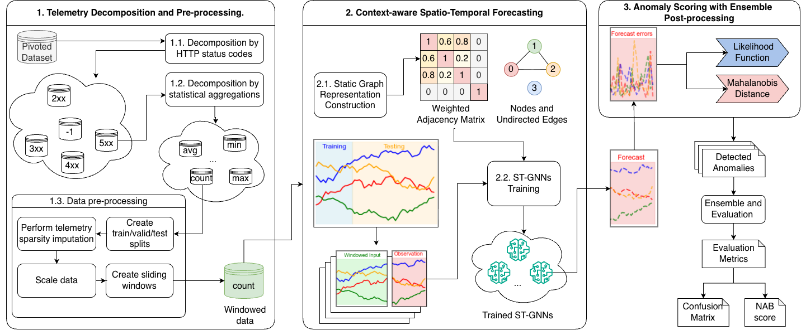

# ClouDens: Operational Context-Aware Anomaly Detection for Large-scale Cloud System Monitoring

[](https://arxiv.org/abs/2607.18127)
[](https://doi.org/10.5281/zenodo.14062900)


This repository contains the official implementation of our paper submitted to **IEEE Transactions on Network and Service Management (TNSM)** with title **"ClouDens: Operational Context-Aware Anomaly Detection for Large-scale Cloud System Monitoring"**.

ClouDens is an ensemble-based anomaly detection framework built on spatio-temporal graph neural networks (ST-GNNs), with features tailored for large-scale cloud telemetry. This repository includes scripts for every step of the pipeline — data pre-processing, model training, anomaly scoring, ensembling, and evaluation/plotting — configured end-to-end with [Hydra](https://github.com/facebookresearch/hydra) so experiments can be reproduced or swept from the command line.

## 🔍 Overview



This repository includes:

- Preprocessing scripts for the IBM Cloud dataset, splitting it into per-HTTP-status-code / per-aggregation feature subsets
- Forecasting-based model implementations: **ClouDens (A3T-GCN)** and eight baselines — **GRU**, **GDN**, **TranAD**, **AnomalyTransformer**, **OmniAnomaly**, **USAD**, **MTAD-GAT**, **GST-PRO**
- Anomaly scoring on forecast errors with multiple post-processing strategies, including the *Anomaly Likelihood Function* and *Mahalanobis Distance*
- An ensemble stage that combines scores from models trained on different feature subsets
- Evaluation via NAB scores (`standard` / `reward_fn` profiles), AUC-PR/VUS-PR, precision, recall, and false-positive-rate metrics, plus plotting and LaTeX table generation for the paper's figures/tables

---

## 1 Requirements

- **Python Version**: Python 3.12.2
- **Operating System**: Windows, macOS, or Linux
- **Tools**: Python, `pip`, a terminal

## 2 Setup Instructions

### 2.1 Clone the Repository
```bash
git clone https://github.com/doanthihoaithu/cloudens.git
cd cloudens
```

### 2.2 Verify Python Version
```bash
python --version
```
If Python 3.12.2 is not installed, download it from the [official Python website](https://www.python.org/downloads/release/python-3122/).

### 2.3 Create and Activate a Virtual Environment
```bash
python -m venv venv
```
- **Windows**: `venv\Scripts\activate`
- **macOS/Linux**: `source venv/bin/activate`

### 2.4 Install Dependencies
```bash
pip install -r requirements.txt
```
Key dependencies: `torch`, `torch_geometric`, `torch-geometric-temporal` (model implementations), `tensorflow`/`keras` (GRU baseline), `hydra-core`/`omegaconf` (configuration), `pandas`/`pyarrow`/`fastparquet` (data I/O), `scikit-learn`/`scipy` (scaling, Mahalanobis distance), `matplotlib` (plotting).

### 2.5 Create Your Local Config
`conf/config.yaml` is git-ignored (it's the file you'll edit for your own runs). Seed it from the tracked example:
```bash
cp conf/config.yaml.example conf/config.yaml
```

### 2.6 Directory Structure
```plaintext
cloudens_ad/
├── conf/                     # config.yaml.example (tracked) + your local config.yaml (git-ignored)
├── src/                      # Source code (see §4)
├── data/                     # git-ignored — populate as described in §3
│   ├── massaged/             # Pivoted input data (pivoted_data_all.parquet, ...)
│   ├── labels/                # Anomaly window labels (anomaly_windows.csv)
├── experimental_results/     # Aggregated result CSVs referenced by the paper
├── figures/                   # Generated + paper figures (figures/for_paper/ holds camera-ready versions)
├── trained_models/           # git-ignored — models, scores, and grid-search outputs (see §6)
```
These directories (other than `data/`, populated in §3) already exist in the repo; `data/`, `trained_models/`, and `conf/config.yaml` are git-ignored since they're either downloaded inputs or generated outputs.

## 3 Data Source
The data required for this project is provided in the following dataset:
> Islam, M. S., Rakha, M. S., Pourmajidi, W., Sivaloganathan, J., Steinbacher, J., & Miranskyy, A. (2024).
> Dataset for the paper "Anomaly Detection in Large-Scale Cloud Systems: An Industry Case and Dataset" (v1.0) [Data set].
> Zenodo. https://doi.org/10.5281/zenodo.14062900

Download the pivoted data and anomaly labels into `data/`:
```bash
mkdir -p data/labels data/massaged
curl -L -o data/labels/anomaly_windows.csv https://zenodo.org/records/14062900/files/anomaly_windows.csv?download=1
curl -L -o data/massaged/pivoted_data_all.parquet https://zenodo.org/records/14062900/files/pivoted_data_all.parquet?download=1
```

## 4 Source Code (`src/`)

### 4.1 Data pipeline
- **`preprocessing.py`** — Core data-preparation built-ins: loads a feature subset, builds the adjacency matrix (`build_adjacency_matrix_no_group`), and filters training/testing anomaly windows.
- **`ibm_dataset_loader.py`** — `IBMDatasetLoader` class: the central object that loads a feature subset's parquet/labels, builds train/test tensors, scales features, and exposes metadata (node ids, test index, test labels) consumed by every downstream script.
- **`run_preprocessing.py`** — Hydra entrypoint. Extracts and saves one or many feature subsets to `data/massaged/extracted/<subset>/` based on `data_preparation_pipeline` in the config.

### 4.2 Models (`src/model_wrappers/`)
Each file wraps one forecasting architecture behind a common train/predict interface used by the training scripts:

- `A3TGCNWrapper.py` — A3T-GCN (ClouDens' base model) — attention temporal graph convolutional network
- `GRUWrapper.py` — GRU-based sequence autoencoder baseline
- `GDNWrapper.py` — GDN, Graph Deviation Network
- `TranADWrapper.py` — TranAD, two-decoder Transformer for next-step forecasting
- `AnomalyTransformerWrapper.py` — Anomaly Transformer (anomaly-attention blocks)
- `OmniAnomalyWrapper.py` — OmniAnomaly, stochastic recurrent neural network
- `USADWrapper.py` — USAD, unsupervised anomaly detection via adversarial autoencoders
- `MTADGATWrapper.py` — MTAD-GAT, multivariate anomaly detection via graph attention networks
- `GSTPROWrapper.py` — GST-Pro, graph spatiotemporal process model

### 4.3 Training & ensembling
- **`run_training_single_model.py`** — Hydra entrypoint. Trains/evaluates the single model + feature subset selected by `evaluation.use_model` and `data_preparation_pipeline.features_prep.filter`, runs the post-processing grid search, and writes outputs under `trained_models/`.
- **`run_training_multiple_models.py`** — Sweeps `multiple_evaluation` (models × sliding windows × HTTP-code/aggregation subsets × NaN-fill strategies × null-padding options), calling the same training/scoring path as above for every combination.
- **`run_ensemble_approach.py`** — Combines grid-search outputs from multiple already-trained base models/subsets into ensemble scores, using either `evaluation.ensembles.auto_combination` (all combinations up to `num_selection`) or `evaluation.ensembles.manual_combination` (a fixed subset list), per `combination_mode`.
- **`run_ensemble_approach_new.py`** — Ensembling variant driven off a pre-computed `combined_grid_search_results_fix_fill_nan.csv` summary; it first selects each base model's *optimal* scoring hyperparameters per subset/sliding-window (via `analysis_results.py` helpers) and then ensembles those optimal configurations, rather than sweeping raw combinations.

### 4.4 Scoring & metrics
- **`anomaly_likelihood.py`** — Computes the anomaly likelihood score from historical reconstruction error using a rolling short/long-window statistical model.
- **`nab_scoring.py`** — Implements NAB (Numenta Anomaly Benchmark) scoring under the `standard` and `reward_fn` (a.k.a. `low_fn`) profiles.
- **`utils.py`** — Shared built-ins: random-seed control, Mahalanobis-distance computation (with/without NaN masks), project-root resolution, JSON/numpy encoding, etc.
- **`metrics/Metric.py`** — Abstract `Metric` base class (`name`, `score`) implemented by the metrics in `metrics/ffvus/` (VUS-PR / FFVUS range-based metrics).

### 4.5 Plotting & reporting
- **`plotting_module.py`** — Visualization utilities: reconstruction-error/Mahalanobis plots, LaTeX table generators (`generate_latex_full_table`, `generate_latex_ensemble_table`, `generate_latex_selected_table`, `generate_latex_training_inference_time`), and false-discovery-rate figure generation.
- **`plot_figures.py`** — Hydra entrypoint producing the paper's time-series and detected-anomaly figures (raw series, zoomed windows, ensemble comparisons) for a chosen model/subset/sliding-window.
- **`plot_fpr.py`** — Hydra entrypoint generating the false-positive-rate comparison figure across models/subsets defined under `plotting.false_discovery_rate`.
- **`analysis_results.py`** — Hydra entrypoint that merges grid-search/computation-time results across models and sliding windows, extracts each model's optimal scoring hyperparameters, and renders comparison figures/tables used across the pipeline (imported by several other scripts).
- **`generate_latex_data.py`** — Hydra entrypoint that emits the LaTeX table sources for the paper (full results table, ensemble table, selected/optimal table, training/inference time table).

### 4.6 Tests & exploration
- **`test_model_implementation.py`** — "Overfit-a-single-batch" sanity test for every model wrapper: repeatedly trains each model on one fixed synthetic batch and asserts the loss drops below `PASS_RATIO` of its initial value within a fixed number of steps, catching broken forward/loss/backward implementations. Run with `python src/test_model_implementation.py`.
- **`cloudens_analysis.ipynb`** — Notebook for ad hoc/exploratory analysis of results.

## 5 Configuration (`conf/config.yaml`)

Everything is driven by one Hydra config (seed your own from `conf/config.yaml.example`, see §2.5). Key sections:

- **`modeling.random_seed`** — global random seed.
- **`supported_models`** / **`supported_sliding_windows`** — the model names and sliding-window sizes swept by `analysis_results.py`/plotting scripts.
- **`evaluation`** — single-model training/evaluation settings: `use_model` (one of `GRU`, `A3TGCN`, `GDN`, `TranAD`, `OmniAnomaly`, `USAD`, `MTAD-GAT`, `GST_PRO`, `AnomalyTransformer`), `slide_win`, `fill_nan` strategy, batch sizes, epochs, `nab_scoring_profiles`, `post_processing_strategies` (`likelihood`, `mahalanobis`), anomaly thresholds, and `evaluation.ensembles` (`combination_mode`, `auto_combination`, `manual_combination`) used by the ensemble scripts.
- **`data_preparation_pipeline`** — feature-subset selection (`features_prep.filter.http_codes`/`aggregations` for a single subset, `feature_subsets` for `multiple_preprocessing: true`), NaN/null-padding handling, and paths to the input parquet/labels files and train/test date splits.
- **`plotting`** — output directory, which model/subset combination to plot, and `false_discovery_rate` sweep settings for `plot_fpr.py`.
- **`multiple_evaluation`** — the sweep grid (`models`, `slide_wins`, `subsets`, `fill_nan_values`, null-padding options) consumed by `run_training_multiple_models.py`.
- **`model_configs`** — per-model settings (checkpoint filename, sliding window, null-padding overrides) for every supported model.

## 6 Execution

The workflow is configured end-to-end with Hydra — every script below accepts config overrides on the command line, e.g. `python src/run_training_single_model.py evaluation.use_model=A3TGCN evaluation.retrain=true`.

### 6.1 Preprocess feature subsets
```bash
python src/run_preprocessing.py
```
With `data_preparation_pipeline.multiple_preprocessing: false`, this extracts the single subset defined by `features_prep.filter`. With `true`, it iterates over every `http_codes` × `aggregations` combination in `feature_subsets`. Output lands in `data/massaged/extracted/<subset>/` (`adjacency_matrix.npy`, `filtered_raw_data.parquet`, `meta_data.json`).

### 6.2 Train a single model on a single feature subset
```bash
python src/run_training_single_model.py
```
Uses `evaluation.use_model` and `data_preparation_pipeline.features_prep.filter` to pick the model and subset, trains it, runs the post-processing grid search, and writes results to `trained_models/window_<slide_win>/<subset>/.../<model>/` (see §7 for the exact layout).

### 6.3 Sweep many models/subsets/sliding windows
```bash
python src/run_training_multiple_models.py
```
Iterates over every combination in `multiple_evaluation` (models × sliding windows × HTTP-code/aggregation subsets × NaN-fill strategies × null-padding options), calling the same training/scoring path as §6.2 for each. This is what the paper's full grid of results was generated from — expect a long run.

### 6.4 Ensemble base-model outputs
```bash
python src/run_ensemble_approach.py
```
Combines already-trained base models/subsets per `evaluation.ensembles` (`auto_combination` or `manual_combination`, per `combination_mode`). Results are written to `trained_models/window_<slide_win>/ensemble/ensemble_final_result_<subsets>.csv`.

For the "optimal configuration" ensembling used in the paper (each base model's best scoring hyperparameters per subset/window, then ensembled):
```bash
python src/run_ensemble_approach_new.py
```
This requires `trained_models/.../combined_grid_search_results_fix_fill_nan.csv` to already exist (produced via `analysis_results.py`) — **ensure all relevant base models have been trained (§6.2/§6.3) before running either ensemble script.**

### 6.5 Aggregate results and generate figures/tables
```bash
python src/analysis_results.py       # merge grid-search + computation-time results across models/windows, extract optimal hyperparameters
python src/plot_figures.py           # time-series / detected-anomaly figures
```

### 6.6 Sanity-check model implementations
```bash
python src/test_model_implementation.py
```

## 7 Output Layout (`trained_models/`)

```plaintext
trained_models/
├── window_<slide_win>/                              # one folder per sliding window (e.g. window_6)
│   ├── no_group_<http_code>_<aggregation>/           # one folder per feature subset (e.g. no_group_5xx_count)
│   │   ├── fill_nan_with_<zero|mean|median>/
│   │   │   ├── <Model>/                              # e.g. GRU, A3TGCN, A3TGCN_null_padding_feature, TranAD, ...
│   │   │   │   ├── <Model>_autoencoder.pt|.h5         # saved model checkpoint
│   │   │   │   ├── <Model>_grid_search.csv            # NAB score per threshold / post-processing strategy
│   │   │   │   ├── <Model>_predictions_for_assembles.csv
│   │   │   │   ├── reconstruction_errors.npy          # raw forecast errors
│   │   │   │   ├── mahalanobis.npy                    # cached Mahalanobis distances
│   │   │   │   ├── mse_error.txt
│   ├── ensemble/                                      # ensemble_final_result_<subset1>+<subset2>+....csv
│   ├── computation_time_comparision.png
├── merged_results/                                   # cross-window/cross-model summaries (analysis_results.py output)
│   ├── computation_time_comparision.csv / .png
│   ├── model_performance_across_sliding_windows.png
│   ├── *_optimal_scoring_hyperparameters.csv
│   ├── *_ensembles_summary_window_<n>_<profile>.csv
│   ├── latex/                                          # generated LaTeX table sources
```

Each `<Model>_grid_search.csv` reports NAB scores under both the `standard` and `reward_fn` profiles across thresholds/post-processing strategies; each `ensemble_final_result_*.csv` reports the equivalent for a specific combination of ensembled feature subsets, selecting the post-processing strategy that maximizes the NAB score under each profile.

## 8 Running on a Cluster (Slurm)

Five ready-to-adapt Slurm scripts at the repo root wrap the commands from §6 (update `--mail-user`, partition/GPU flags, and the `torch210_new` venv path for your cluster):

- `slurm_script_new.sh` — `python src/run_training_single_model.py`
- `slurm_script_multiple_training.sh` — `python src/run_training_multiple_models.py`
- `slurm_script_essembles.sh` — `python src/run_ensemble_approach_new.py`
- `slurm_script_plot.sh` — `python src/plot_fpr.py`
- `slurm_script_latex_tables.sh` — `python src/generate_latex_data.py`

## Notes for Replicability

- Use Python 3.12.2 to avoid compatibility issues.
- Keep `requirements.txt` up to date if new dependencies are added.
- `conf/config.yaml`, `data/`, and `trained_models/` are git-ignored — set them up per §2.5/§3 rather than expecting them from a fresh clone.
- Train all base models/subsets you intend to ensemble (§6.2/§6.3) before running the ensemble scripts (§6.4).